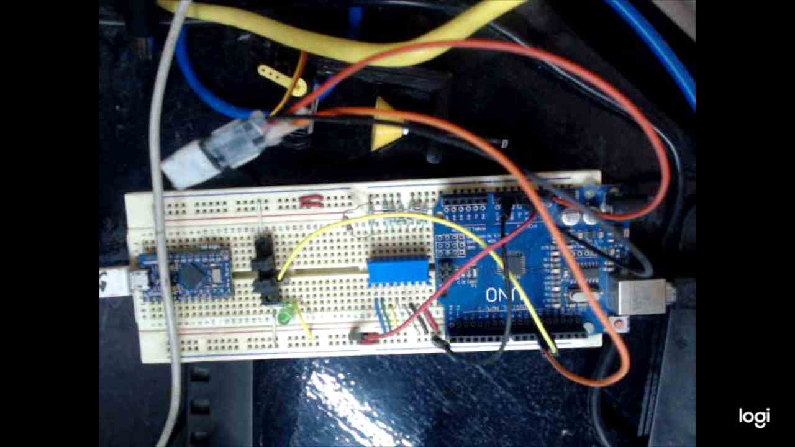

# Uno Turns On PC.
Helped with a servomotor and connecting the source to a smart-plug such as AmazonSmartPlug, Sonoff or Magic-home, on startup the microcontroller moves a servomotor to press the power button of a laptop. If there is no response (either a enabling a pin or IR signal)

## Software needed.
* Arduino IDE (latest version). 

## Hardware needed.
* This version in compatible with:
    - Arduino UNO
    - Arduino MEGA
    - Node MCU
    - ESP32
* Servomotor (SG90 suggested).
* 3D printed adapters to hold the servomotor that can be found [here](https://github.com/jjjpolo/servoMotorClamp).
* (Optional) Barrier sensorIR LED and IR transistor (as an option to detect when the PC is powered on).
* (Optional) the complement of this project is a programmed keyboard based on a 32u4 uController. You can find the project [here](https://github.com/jjjpolo/dueLogsIn).

## Circuit.
* Arduino UNO pin 11 - Servomotor signal 
* (Optional) Arduino UNO pin 12 - IR input signal (to detect when the pc was powered on successfully).

## How it works. 
This project is made after two uControllers working together.
The first one (this project) is in charged of pressing the powering on button using the servomotor. It will be trying until either the 2nd uController sends the IR signal or certain number of attempt failed.
The other microcontroller (a 32u4 programmed as a keyboard) will notify the 1st uController when to stop trying to turn on the laptop and will execute some commands (as a rubber ducky) to unlock the PC.

## What it looks like?
